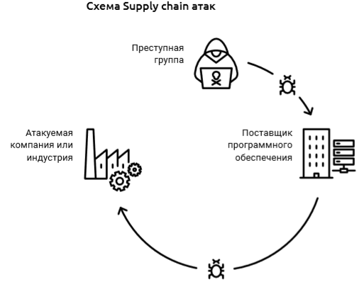

# Новые вызовы цифрового мира
## 2017-2018 годы: ущерб от глобальной киберпреступности продолжает расти
На протяжении последних нескольких лет глобальная киберпреступность растет все интенсивнее, а атаки становятся более масштабными и критическими, нанося колоссальный ущерб мировой экономике. Оглядываясь на события минувшего года, мировые эксперты признают кибератаки одним из основных глобальных рисков, и не просто так — по данным Всемирного экономического форума (ВЭФ), общие потери от кибератак в 2017 году составили \$1 трлн, и, если ничего не предпринять, через несколько лет достигнут \$8 триллионов[^1].  
Однако даже эти цифры не отражают действительной картины. Количество известных киберпреступлений составляет не более 20%, так как организации-жертвы не готовы раскрывать информацию о произошедших инцидентах, боясь потерять «лицо» и лишиться доверия клиентов. Таким образом, большая часть действий киберпреступников остается в тени, и оценить реальный ущерб от кибератак практически невозможно.  

> Современные киберпреступники – это больше не хакеры-одиночки. Организация крупных кибергруппировок напоминает структуру международных корпораций — с сотнями «сотрудников», распределенных по разным странам, и прекрасно отлаженными бизнес-процессами. Типичный пример — недавно лишившаяся лидера группировка Carbanak, участники которой похищали из банков средства и при помощи сообщников обналичивали их в банкоматах по всей Европе. Такие группировки находятся одновременно на нескольких континентах и быстро ориентируются в нововведениях в киберпространстве. Они в считаные часы способны беспрепятственно проводить масштабные атаки и молниеносно заметать цифровые следы.  

## Широкомасштабные атаки
2017 год стал годом массовых широкомасштабных нападений, цель которых — атаковать максимальное количество устройств и вывести из строя инфраструктуру организации. Наиболее громкие примеры — это атаки шифровальщиков WannaCry и NotPetya, которые нанесли колоссальный ущерб многим международным корпорациям. 

> Только открыто заявившие об атаках Maersk[^2] и FedEx[^3] совокупно потеряли более \$600 миллионов, а ведь количество пострадавших организаций превышало сотни тысяч.  

Однако финансовый ущерб — не единственная опасность широкомасштабных атак. Невнимательное отношение к обновлениям ПО и отсутствие киберграмотности приводит к последствиям, ставящим под угрозу жизни многих людей — так, из-за атаки WannaCry в более чем 80 больницах Великобритании стали недоступны системы записи на прием и вся диагностическая аппаратура, а хирурги не могли оперировать пациентов в критическом состоянии.  
Основная причина уязвимости к такого рода атакам — низкий уровень киберграмотности. Доверчивость сотрудников делает их уязвимыми к фишинговым рассылкам (подставным письмам, отправленными злоумышленниками), а любопытство заставляет перейти по вирусной ссылке или скачать вредоносный документ. Для заражения даже хорошо защищенной крупной организации достаточно лишь одного такого наивного сотрудника.  
## Новые технологии — не только развитие, но и угроза
В 2017-2018 годах продолжается повсеместное внедрение Интернета вещей (IoT, Internet of Things) — подключенных к сети бытовых и пользовательских устройств, о защите которых пользователи практически никогда не задумываются. Подключенный к сети компании «умный» чайник с устаревшим ПО и паролем по умолчанию (который, как правило, прекрасно известен злоумышленникам) может стать окном для доступа в инфраструктуру всей организации и проведения масштабной атаки с серьезными последствиями. Например, именно таким путем в 2017 году злоумышленники смогли выкрасть базу данных одного из игорных домов в США: они просто взломали термометр в аквариуме казино[^4].
Внедрение IoT-устройств сегодня происходит намного быстрее адаптации мирового сообщества к новым технологиям. До сих пор в мире нет четких закрепленных законодательством стандартов, как нет и отлаженных процессов по обеспечению кибербезопасности таких систем. Все это делает IoT-системы и их владельцев максимально уязвимыми к атакам.
## Supply-chain атаки
Еще одна тенденция 2017-2018 годов – атаки supply-chain (атаки на «слабое звено»), когда злоумышленники не атакуют конечную цель напрямую, а внедряют в программное и аппаратное обеспечение поставщика («слабого звена») специально встроенные уязвимости («бэкдоры»), при помощи которых преступник может получить доступ к системе целевой организации.
  
Этим объясняется резкий рост их популярности: по данным Symantec, в 2017 году количество supply-chain атак возросло на 200%[^5]. При этом не существует единственно верного способа от них защититься.  
Защита от supply-chain атак требует многоуровневого комплексного подхода – повышения киберграмотности сотрудников, внедрения средств защиты компании, постоянного обмена информацией игроков рынка и грамотного законодательства, в том числе на международном уровне.
## Заключение
Ландшафт киберугроз с каждым днем становится все разнообразнее и обширнее.  
Киберпреступники изобретают новые векторы атак, используют старые уязвимости и находят новые, придумывают все более хитрые психологические приемы для обмана пользователей.  
Количество киберпреступлений растет, и злоумышленники, объединяясь в группировки, работают эффективно, сообща и оперативно, опережая реакцию мирового сообщества и все время оказываясь на шаг впереди.

Мировое сообщество может противостоять киберпреступности, но для этого необходимы совместные усилия.  
Открытый диалог, постоянный обмен информацией и эффективное сотрудничество на международном уровне – вот рецепт успешного противостояния глобальной киберпреступности и ключ к безопасности в интернет-среде. 

[^1]: http://reports.weforum.org/global-risks-2018/global-risks-2018-fractures-fears-and-failures/
[^2]: https://www.zdnet.com/article/maersk-forced-to-reinstall-4000-servers-45000-pcs-due-to-notpetya-attack/
[^3]: https://www.zdnet.com/article/notpetya-cyber-attack-on-tnt-express-cost-fedex-300m/
[^4]:   https://www.washingtonpost.com/news/innovations/wp/2017/07/21/how-a-fish-tank-helped-hack-a-casino/
[^5]: https://www.symantec.com/content/dam/symantec/docs/reports/istr-23-executive-summary-en.pdf